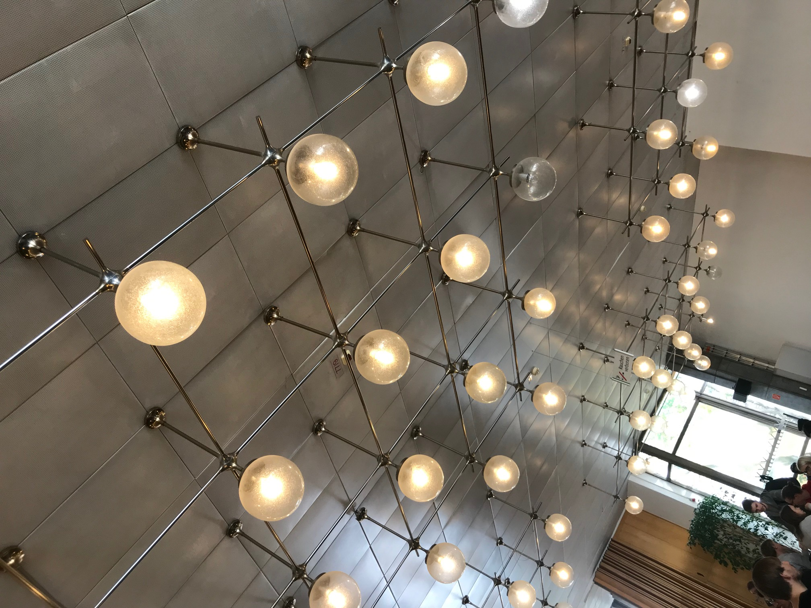

# Lights in Mensa

__problem__: 

1) The lights in the Bauhaus University Mensa are always on , even during the afternoons on sunny days.

2) This is a usability issue because the lights might not contribute significantly to the overall visibility in the room , in comparison to the natural light from the windows 
but at the same time consume a lot of electricity unnecessarily. 

__solution__: 

1) The lights could be programmed to be on or off as per the incoming light from the windows and other inlets. That way we can optimize the amount of light within the room at a particular time along with the electricity consumption.

